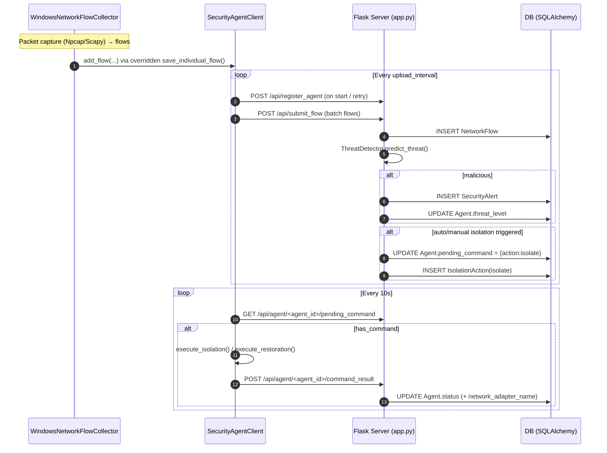
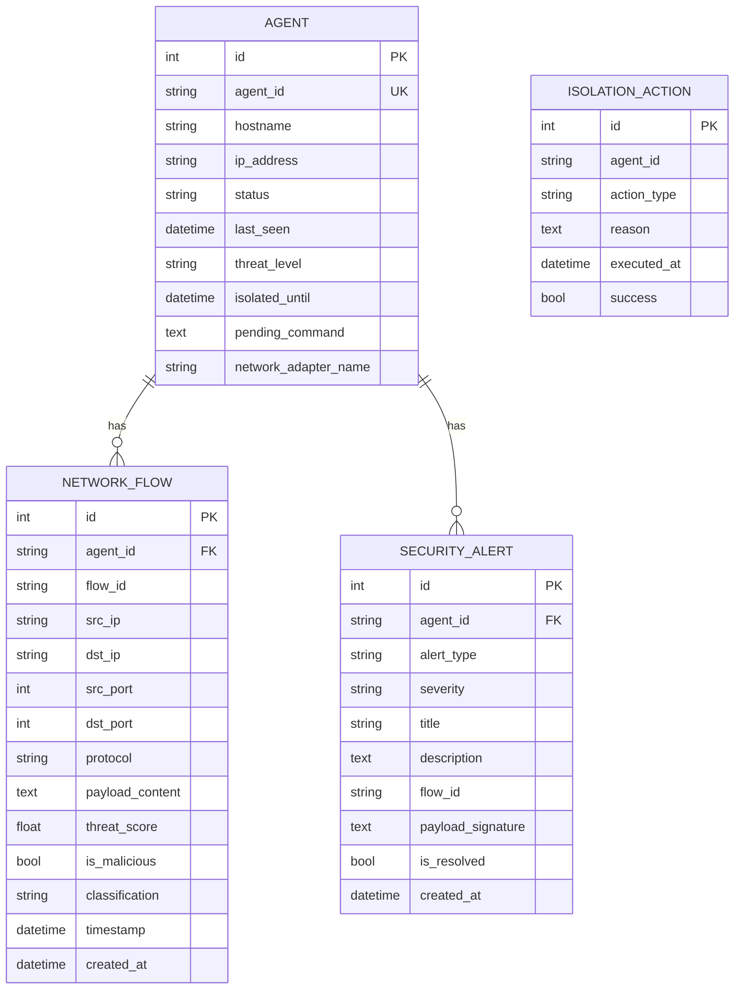

# Architecture Overview — Network Security Management System

This document summarizes the high-level architecture and end-to-end data flow of the project.

## 1) Big picture (runtime)

```mermaid
flowchart LR
  %% =====================
  %% AGENT SIDE (WINDOWS)
  %% =====================
  subgraph W[Windows Host (Agent Machine)]
    direction TB
    N[Npcap + Scapy packet capture]

    C[WindowsNetworkFlowCollector<br/>(network_flow_collector_windows/network_flow_collector_windows.py)]

    Q[(Flow state\n+ 79 features\n+ payload hex dump)]

    A[SecurityAgentClient<br/>(web application/security_agent_client.py)]

    FW[Windows Firewall / NetAdapter<br/>(netsh / PowerShell)]

    N --> C --> Q
    C -. overrides save_individual_flow .-> A
    A --> FW
  end

  %% =====================
  %% CENTRAL HUB (SERVER)
  %% =====================
  subgraph S[Central Management Server (Flask)]
    direction TB
    APP[Flask app + REST API + Web UI<br/>(web application/app.py)]
    TD[ThreatDetector<br/>(loads best_model.pkl)]
    UI[HTML Templates + JS<br/>(web application/templates + static)]

    APP --> TD
    APP --> UI
  end

  %% =====================
  %% DATA STORAGE
  %% =====================
  DB[(Database)<br/>SQLAlchemy models:<br/>Agent, NetworkFlow, SecurityAlert, IsolationAction]

  %% =====================
  %% ADMIN
  %% =====================
  subgraph B[Admin Browser]
    direction TB
    D[Dashboard / Agents / Alerts / Flow details]
  end

  %% =====================
  %% NETWORK FLOWS
  %% =====================
  A -- POST /api/register_agent --> APP
  A -- POST /api/submit_flow --> APP
  A -- GET /api/agent_status/<agent_id> --> APP
  A -- GET /api/agent/<agent_id>/pending_command --> APP
  A -- POST /api/agent/<agent_id>/command_result --> APP

  APP -- store/query --> DB

  D -- HTTP GET pages --> APP
  D -- AJAX: /api/dashboard/*, /api/alerts/recent, /api/agents/status --> APP

  APP -- queue command (pending_command) --> DB
  APP -- isolate/restore decisions --> APP

  %% =====================
  %% ISOLATION CONTROL LOOP
  %% =====================
  APP -. admin action: /isolate/<agent_id>, /restore/<agent_id> .-> APP
  APP -. auto-isolation: threats_detected > 5 or critical .-> APP
  APP -- pending_command JSON --> A
  A -- executes firewall isolation/restoration --> FW
  A -- reports result --> APP
```

## 1.3) Illustration — Report-style overview (boxed layout)

```mermaid
flowchart LR
  %% A layout closer to a typical thesis/report figure: boxed columns + clear boundaries.

  subgraph SYS[Network Security Management System]
    direction LR

    subgraph COL[Agent Side (Windows Host)]
      direction TB
      cap[Npcap + Scapy capture]
      collector[WindowsNetworkFlowCollector]
      enrich[Flow aggregation<br/>79 features + payload hex]
      agent[SecurityAgentClient<br/>queue + upload + poll commands]
      isolation[Enforce isolation<br/>Windows Firewall rules]
      cap --> collector --> enrich --> agent
      agent --> isolation
    end

    subgraph NET[Network]
      direction TB
      http[HTTP/JSON over LAN/WAN<br/>port 5000 (default)]
    end

    subgraph SRV[Central Hub (Flask Server)]
      direction TB
      api[REST API endpoints]
      detect[ThreatDetector<br/>loads best_model.pkl<br/>uses 68/79 features]
      ui[Web UI (templates + static)]
      decide[Isolation decision<br/>manual + auto]
      api --> detect
      api --> ui
      api --> decide
    end

    subgraph DATA[Data Layer]
      direction TB
      db[(DB: Agents / Flows / Alerts / Actions)]
      model[(best_model.pkl)]
    end

    COL --> NET --> SRV
    SRV --> DATA
    detect --- model
    api --> db
    decide --> db
  end

  admin[Admin Browser] --> ui
  agent -- POST /api/register_agent<br/>POST /api/submit_flow --> api
  agent -- GET /api/agent/&lt;id&gt;/pending_command --> api
  agent -- POST /api/agent/&lt;id&gt;/command_result --> api
```

## 1.1) Illustration — Agent ↔ Server interaction (sequence)



## 1.2) Illustration — Data model (database)



## 2) End-to-end data flow (what happens when traffic is captured)

1. **Capture packets (Windows)**: `Npcap + Scapy` sniff packets on one interface or all interfaces.
2. **Build flows + features (collector)**: `WindowsNetworkFlowCollector` aggregates packets into flows, computes CIC-IDS style features (79), and extracts a hex-dump style payload snippet.
3. **Send to server (agent client)**:
   - The collector integrates with `SecurityAgentClient` by overriding `save_individual_flow()` so each completed flow is also pushed into the agent client's queue.
   - The agent uploads batches to the server periodically.
4. **Server persists + scores threats**:
   - `Flask` receives `/api/submit_flow`.
   - `ThreatDetector` loads `best_model.pkl` and uses the first **68** features for prediction (79 collected, 68 used).
   - The server stores `NetworkFlow` and creates `SecurityAlert` when malicious.
5. **Isolation loop**:
   - If critical / too many threats: server queues a `pending_command` (`isolate` / `restore`).
   - Agent polls `pending_command`, executes Windows firewall isolation/restoration, then posts back the result.
6. **UI surfaces everything**: Admin views dashboard/agents/alerts/flows from the web UI.

## 3) Major components & where they live

- **Collector (Windows packet → flows/features/CSV)**
  - `network_flow_collector_windows/network_flow_collector_windows.py`
  - Optional tools: `network_flow_collector_windows/flow_analyzer_windows.py`, `network_flow_collector_windows/flow_labeler_windows.py`

- **Agent client (uploads + command execution)**
  - `web application/security_agent_client.py`
  - Key responsibilities: register, upload flows, poll commands, execute isolation via firewall/net adapter.

- **Management server (Flask)**
  - `web application/app.py`
  - Key responsibilities: API, threat detection, persistence, admin web UI, isolation queue.

- **Web UI**
  - Templates: `web application/templates/*.html`
  - Static assets: `web application/static/css/*`, `web application/static/js/*`

- **ML model artifact**
  - `best_model.pkl` (loaded by `ThreatDetector`)
  - Helper scripts: `inspect_pkl.py`, `test_model.py`, `test_threat_detector.py`

## 4) Key server APIs (agent-facing)

- `POST /api/register_agent` — initial registration/update
- `POST /api/submit_flow` — upload flow batches
- `GET /api/agent_status/<agent_id>` — status + instructions
- `GET /api/agent/<agent_id>/pending_command` — isolation/restore command queue
- `POST /api/agent/<agent_id>/command_result` — execution result callback

## 5) Notes / sanity checks

- The UI in `agent_detail.html` shows a PowerShell snippet pointing to `/api/agent/heartbeat`, but the Flask app currently does **not** define that endpoint. The real agent loop uses `/api/register_agent`, `/api/submit_flow`, and the polling endpoints above.
- Database config in `web application/app.py` is currently PostgreSQL by default; `setup_and_run.py` and `migrate_database()` contain logic for SQLite migrations as well.
